# Childhood Memories - Front End

 ## PERSPECTIVE

 >There always comes a moment in our life when we wish we could go back to our childhood. Not to change anything, but to feel something twice.
 Childhood is the best of all the seasons of life, and the longer it lasts with happy memories, the stronger the emotional stability in adulthood. Recalling happy memories elicits positive feelings and enhances one’s wellbeing. They strengthen our sense of identity and purpose and bond our relationships. The main motive of this website is to recalling and sharing some of most precious childhood memories and heal our inner child. 

 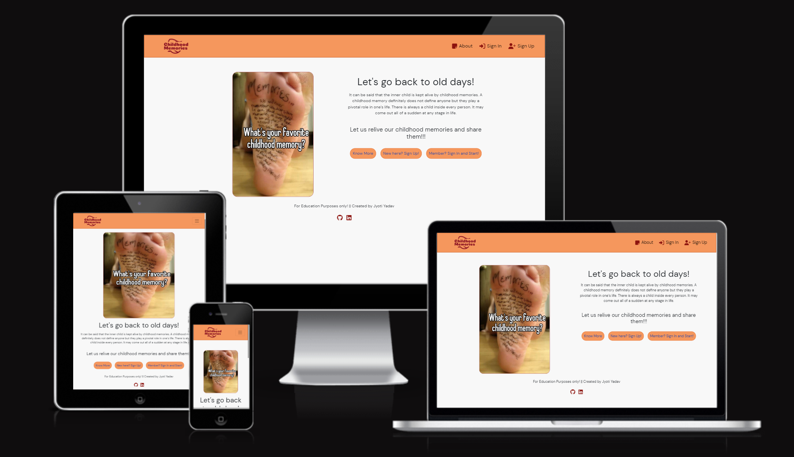

 **Childhood Memories** is a social-media website designed to mimic the features of Twitter. Users can create an account, log in, make a post, make comments on posts, like other users' posts and comments, and change their profile photo and profile biography. This website is designed to allow users to make posts about incomparable memories from their childhood, and be able to engage with other users by commenting and liking on other posts/comments. This is the repository for the React frontend of Childhood Memories, created with HTML, CSS, Bootstrap, React. Components were reused throughout the React project as each part of the website was broken into individual components and linked together, transferring states and data. The project also utilises a Django Rest Framework web API.

 ## Deployed Link

- [Front-End Deployed Link](https://childhood-memories-front-end.herokuapp.com/)

## Back End Links

- [Back End Deployed Link](https://childhood-memories.herokuapp.com/)
- [Back End GitHub](https://github.com/jyotiyadav2508/childhood-memories-drf-api)

## [Contents](#contents)
- [User Experience (UX)](#user-experience-ux)
	- [Site Goals](#site-goals)
	- [Scope](#scope)
    - [Epics and User Stories](<#epics-and-user-stories>)
	    - [Website UI](#website-ui)
        - [Authentication](#authentication)
        - [Navigation](#navigation)
		- [General](#general)
		- [Post Management](#post-management)
        - [Comment Management](#comment-management)
        - [Likes Management](#likes-management)
        - [Profile Management](#profile-management)
    - [Agile Development](#agile-development)
        - [Kanban Board and MosCow Prioritization](#kanban-board-and-moscow-prioritization)
        - [Outline of Sprints](<#outline-of-sprints>)
    - [Acceptance Criteria](<#acceptance-criteria>)
	- [Tasks](<#tasks>)
- [Design](<#design>)
	- [Colours](<#colours>)
	- [Typography](<#typography>)
	- [Imagery](<#imagery>)
	- [Wireframes](<#wireframes>)
- [Features](<#features>)
- [Component](<#component>)
- [Technologies](<#technologies>)
	- [Languages Used](<#languages-used>)
	- [Tools](<tools>)
	- [Frameworks, Libraries and Programs](<#frameworks-libraries-and-programs>)
- [Production](#production)
- [Issues and Fixes](<#issues-and-fixes>)
- [Testing](<#testing>)
- [Deployment](<#deployment>)
	- [Heroku](<#heroku>)
- [Credits and Resources](<#credits-and-resources>)
- [Acknowledgements](<#acknowledgements>)


## User Experience (UX)

### Site Goals
- **Childhood Memories** is a social-media website designed to mimic the features of Twitter.
- User can create an account, log in, make posts about incomparable memories from their childhood, and be able to engage with other users by commenting and liking on other posts/comments. Also user can change their profile photo and profile biography.
- The basic goal is to re-live the happy moments of your childhood and provide a happy mood to the users.
- Users can enable the network using this social media platform.

### Scope

- An attractive and intuitive UX experience: 
	1. Website title that gives an idea what is it about
	2. Hero-image with information on the site's purpose
	3. Responsive design across all devices
	4. A clear and straightforward layout
	5. Footer with links to social media
	6. Implement alert messages to provide users with more feedback after they take certain actions
	7. Fast application that is easy to use
	8. Show user's profile image in the profile section

- An easy navigation for the user through all the pages and features
	1. Navigation Menu with easy access to all links.
	2. Easy Sign Up/ Sign In/ Sign Out functionality visible.
	3. Posts list with infinite scroll feature
	4. Landing page with guidance to sign up/sign in and how to start using the websites features
	6. Search field to enable user to search a keyword
	7. Category filter for easy sorting of posts
	8. User's Feed page with posts from their favourite users
	9. Liked page to enable users to save the posts they liked

- Posts and Comment Features
	1. Latest entries feature on top or first
	2. Click on post to view post details 
	3. Ability to comment and like a posts
    4. Ability to like a comment
	5. Create, Edit and Delete own post and comment.

- Profiles Features
	1. Shows username and Avatar, enlists posts made by the user
	2. Shows information on Followers and other users following
	3. Password change option
	4. Profile edit option

[Back to top ⇧](#contents)

## Epics and User Stories
8 Epics were created which were further developed into 34 User Stories.Many of the user stories are worded similarly to the Moments walkthrough project because the functionality is quite similar - especially with navigation and authentication, posts, likes and comments.

### 1. Website UI

**Epic Goals for End User**

1. A landing page that describes the purpose of the website
2. User guidance to get started 
3. Easy register/sign up and sign in options

**Related User Stories**

- As a **site user** I can **capability** so that **I can easily understand the purpose and main features of the website**
- As a **site user** I can **see well written instructions on how to get started** so that **I can easily get information about how to start use the web application**
- As a **site user** I can **see sign up and sign in to the site** so that **I can easily register or sing in to access the functionality of website.**


### 2. Authentication

**Epic Goals for End User**

1. Access to Sign Up and Sign In Features
2. Access to Sign Out option
3. Refressing access tokens
4. Access to Changing Posts/Comments/Liking
5. Not Liking Own Posts/Comments
6. Not following self

**Related User Stories**

- As a **site user** I can **sign up and sign in to the site** so that **I can access the functionality of website.**
- As a **site user** I can **easily log out** so that **I can have more security on my account.**
- As a **site user** I can **maintain my logged-in status until I choose to log out** so that **my user experience is not compromised**
- As a **site user** I cannot **edit/delete any posts/comments/likes that are not mine** so that **I can be assured that my posts/comments/likes are protected and can only be changed by me.**
- As a **site user** I can **only like/unlike other users' posts and comments** so that **I can only show my appreciation for other posts/comments and not cheat the system by liking my own posts/comments**
- As a **user** I can **only follow other users** so that **I cannot cheat the system and follow myself and gain myself a new, false follower.**

### 3. Navigation

**Epic Goals for End User**

1. An easy to use navigation 
2. Home page with posts list with infinite scroll visible to all
3. Navigation routing
4. Navigation conditional rendering
5. 404 page

**Related User Stories**

- As a **site user** I can **see a navigation bar on every page** so that **I can easily return to pages I wish to visit.**
- As a **site user** I can **infinitely scroll down to see more posts and also to see more comments** so that **I can consistently look at more posts/comments without having to click any extra links to view more.**
- As a **site user** I can **navigate through pages quickly** so that **I can view content smoothly without the pages being refreshed**
- As a **site user** I can **have the navigation bar customed to my logged-in or out status** so that **I can have the options to log in or sign up when logged out, or have the options to create a post, view my profile, sign out, etc when logged in.**
- As a **site user** I can **a nice 404 page consistent with the site layout** so that **I can be communicated with if I have reached an invalid web page.** 

### 4. General

**Epic Goals for End User**

1. Search bar
2. Confirmation messages
3. About page
4. Category filter

**Related User Stories**

- As a **site user** I can **search for posts or users in a search box** so that **I can quickly find specific posts or users that I am wanting to look for.**
- As a **site user** I can **always be notified when my interactions on the website are successful (creating posts/comments, liking/unliking posts, unfollowing/following users, logging in/out, etc** so that **I will always be informed of my actions and whether they are successful or not.**
- As a **site user** I can **easily find the 'About' link** so that **I can learn about the purpose of this website which will be crucial as a new user coming to the website**
- As a **site user** I can **view post category options** so that **I choose posts to display that I’m particularly interested in.**

### 5. Post Management

**Epic Goals for End User**

1. Post visibility
2. Post Details visibility
3. Post Creation Option
4. Post update Option
5. User's Feed page

**Related User Stories**
 - As a **site user** I can **view all the posts on the Homepage** so that **I can view, like and comment those post**
 - As a **site user** I can **view and read the detailed post page of all of the site users** so that **I can view the comments made by different users**
 - As a **site user** I can **create posts** so that **I can share my memories with others**
 - As a **site user** I can **edit/delete my posts** so that **I can make changes to existing post information or remove my content**
 - As a **site user** I can **view all the posts on the User's Feed page** so that **I can see all the posts posted by the people whom I follow**

 ### 6. Comment Management

**Epic Goals for End User**

1. Comments visibility
2. Comments Creation Option
3. Comments update Option
4. Comments Delete Option

**Related User Stories**

- As a **site user** I can **read comments on a post** so that **I can read what others think about the post and read the discussion happening.**
- As a **site user** I can **post a comment on a post** so that **I can contribute discussion to a post or share my thoughts about a post**
- As a **site user** I can **edit/delete my comments** so that **I have the possibility to remove or add more details to my existing comments.**

### 7. Likes Management

**Epic Goals for End User**

1. Like visibility
2. Like/Unlike a post
3. Like/Unlike a comment

**Related User Stories**

- As a **site user** I can **see the post that have received most number of likes** so that **I can assess which are the best ones.**
- As a **site user** I can **like a post** so that **I can share my appreciation for the post and show the author that their post is great.**
- As a **site user** I can **remove likes on a post** so that **I can show that my opinion has changed**
- As a **site user** I can **like/unlike comments** so that **I can share my feelings towards a comment.**

### 8. Profile Management

**Epic Goals for End User**

1. Profile visibility
2. Profile following/ unfollowing user
3. Profile update option
4. Profile popularity assessment


**Related User Stories**

- As a **site user** I can **view a detailed page of users** so that **I can see their posts and learn more about the user. I can also see their following count, followers count, etc.**
- As a **site user** I can **follow or unfollow other users** so that **I can see or choose to remove posts by specific users in my posts feed**
- As a **site user** I can **see the most popular profiles** so that **I can see who has the most interesting posts**
- As a **site user** I can **update my own data** so that **I can make changes as needed**

[Back to top ⇧](#contents)

## Agile Development

An Agile approach was used to manage the completion of this project. Specifically, this meant breaking the project down into smaller tasks with a focus on minimum functionality first. Only when a minimally viable product is ready will extra features be added. In addition, GitHub projects and Issues were used a tool to keep track of the tasks.

What does minimally functioning mean in this context? As with any project, there are real constraints (time, energy, know-how) that force a developer to prioritize the work. Based on my abilities and constraints, I have prioritized the project requirements in the following way:

A functioning front-end with authentication, registration, CRUD operations for a Post and Comment. The focus is on working code.
Implementation of code for adding likes and comments to a Post.
Aesthetics/Design - This is of course important in an advanced front end project, but the goal here is to have just minimal styling at first and then as time permits improve the visual design.

### Kanban Board and MosCow Prioritization

I used a kanban board to help organize the user stories and tasks required for this project. When each task was in progress, they would be dragged to the 'in progress' column. When they were completed, they were dragged to the 'done' column. I also utilized MoSCoW prioritization by labelling each task as Must Have, Should Have and Could Have. I prioritized finishing the Must Have tasks first and then worked on the Should Have tasks. I managed to complete all of the tasks in the end and all user stories are successfully covered.

<details>
<summary>Screenshot of MoSCoW Prioritization Part 1</summary>
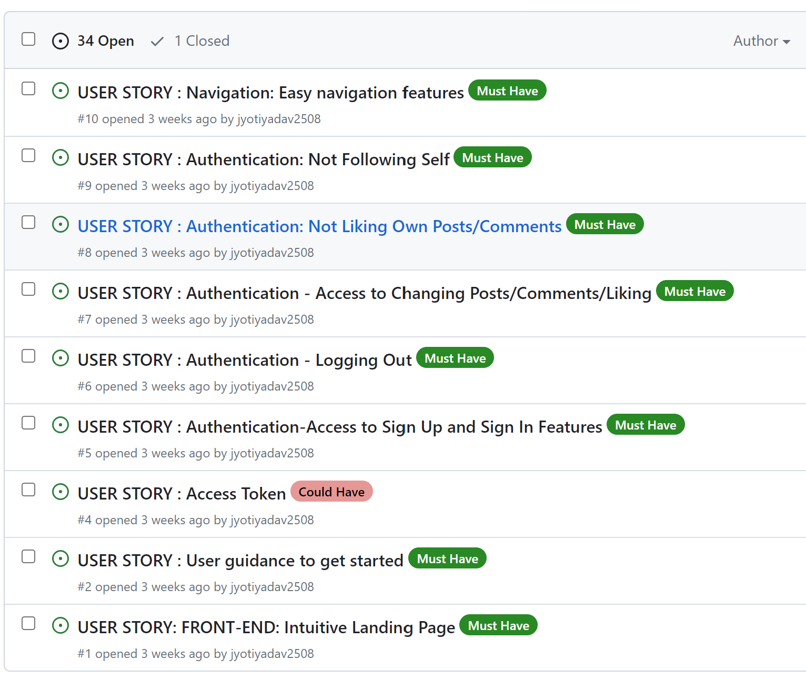
</details>

<details>
<summary>Screenshot of MoSCoW Prioritization Part 2</summary>
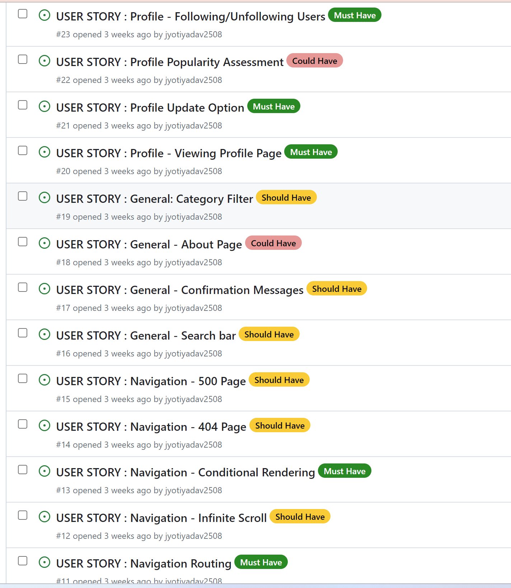
</details>

<details>
<summary>Screenshot of MoSCoW Prioritization Part 3</summary>
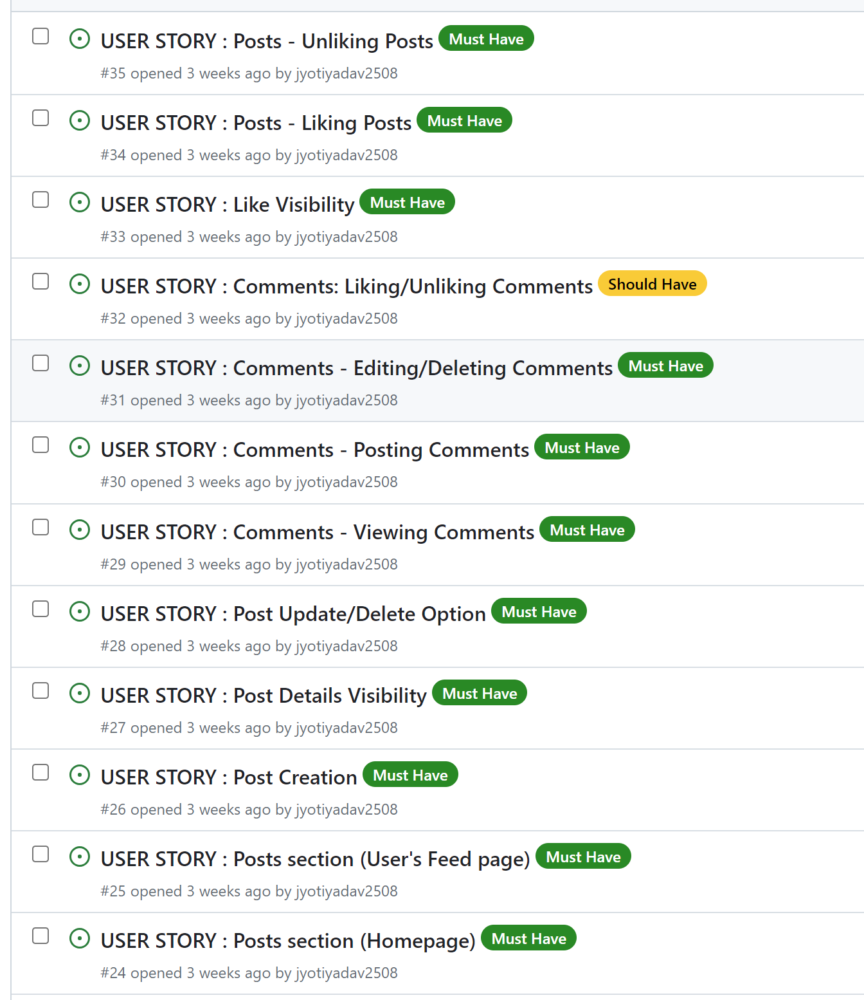
</details>

### Outline of Sprints
The following is an outline of the sprints that were done during the completion of this project.

#### Sprint 1 - Project Setup
Goal: Project environment, authentication functionality.Minimum styling Time: Three Day

  - Setup project
  - Install additional libraries
  - Write User Stories
  - Setup minimal navbar with routing
  - Design minimal sign in and sign up forms
  - Connect sign in and sign up to backend
  - Fix hamburger toggle
  - Access and refresh tokens

#### Sprint 2 - Making a Post
Goal: Users can see posts on home page and add a post. Minimal styling Time: Three Days

  - Design content page
  - Connect to backed to display current posts
  - Design Post form
  - Create a Post
  - Display a Post
  - Like a Post
  - Add links to navbar

#### Sprint 3 - Likes, Comments and Profile page
Goal: Users can add a comment and like a post and comment. Users can see the posts they've liked. Time: Seven Days

  - Add feed and liked link to navbar for logged in user
  - Add filter by like
  - Add edit and delete function for Post.
  - Design add comment form
  - Add, delete, update, and display comments.
  - Add like functionality on comment
  - Create Profile page header which include profile Image, name, follow button
  - Create basic popular profiles component
  - Create follow, unfollow functionality for profiles
  - Update profile page

#### Sprint 4 - General feature, styling and deployment 
Goal: Adjust layout and basic styles for components

  - Intuitive landing page
  - About page
  - Add filter by category
  - Add footer
  - Configure layouts

[Back to top ⇧](#contents)

### Tasks
The tasks for the website development process was closely followed as mentioned in CI's Advanced Frontend React module "I Moments" walkthrough project. The task is generally the developers step towards preparing the app.
The tasks that I have followed during the development phase were carried out in this order.

**Before Project Inception**

- Design Entity Relationship Diagram 
- Set up and create  Back End API. For this backend was built using the Django Rest API framework. All information can be found in [Childhood memories Back End](https://github.com/jyotiyadav2508/childhood-memories-drf-api)
- Create Project, Epics, User Stories and prepare Kanban Board

**Creation of Project in Codeanywhere**
- Set up ReactJS project
- Install dependencies
- Coding
- Testing
- Create Frontend Repository in GitHub

### Future Task
There are a few features I wanted to build on. But due to severe time constraints, the App is in it's basic form.
  - Want to use react-notify-toast to show users notification for their different actions, instead of using custom feedback alert message.
  - Want to add emoji-picker in comment section.
  - Proper category badge display and active badge on clicking.
  - Wish to include a feature where users can add a media file instead of an image file if they wish to share a video.

[Back to top ⇧](#contents)

## Design

### Colours
The colour scheme has considered based on easy accessibility for all.
Complimentarity was key feature in color selection, to give it a pleasant feel for all age groups.
The palette was generated with inspiration from palettes provided by [Coolers](https://coolors.co/). The color palette used is as shown below.
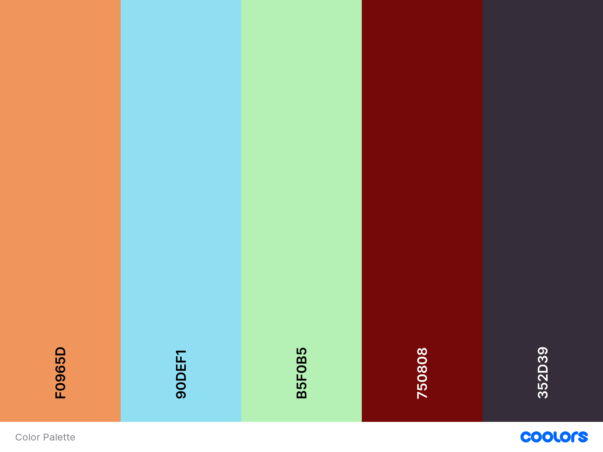

### Typography
Fonts were imported using Google Fonts. Font "'Fredoka One', cursive" was used throughout with a backup of 'Raleway', sans-serif'. It was chosen for easy readability for users.

### Imagery
The imagery on the website has been seleced according to the post requirement. Many images were taken from Pexels.

### Wireframes

The wireframes were generated using Balsamiq. The wireframes can be found in these links:<br>
[Wireframes for Desktop](documentation/wireframes/Desktop-wireframes.pdf)<br>
[Wireframes for Tablet](documentation/wireframes/Tablet-Wireframes.pdf)<br>
[Wireframes for Mobile](documentation/wireframes/Mobile-wireframes.pdf)

[Back to top ⇧](#contents)

## Features

### Landing Page
- Includes navbar, hero-image, main body and a footer
- NavBar features logo, About, Sign Up and Sign in links
- A footer is displayed at the bottom of the landing page
	- Footer contains information about the creator
	- Contains copyrights info
	- Contains links to social media Linkedin and GitHub page (opening in a separate window)
- Landing page main body includes description about the app

As shown here:
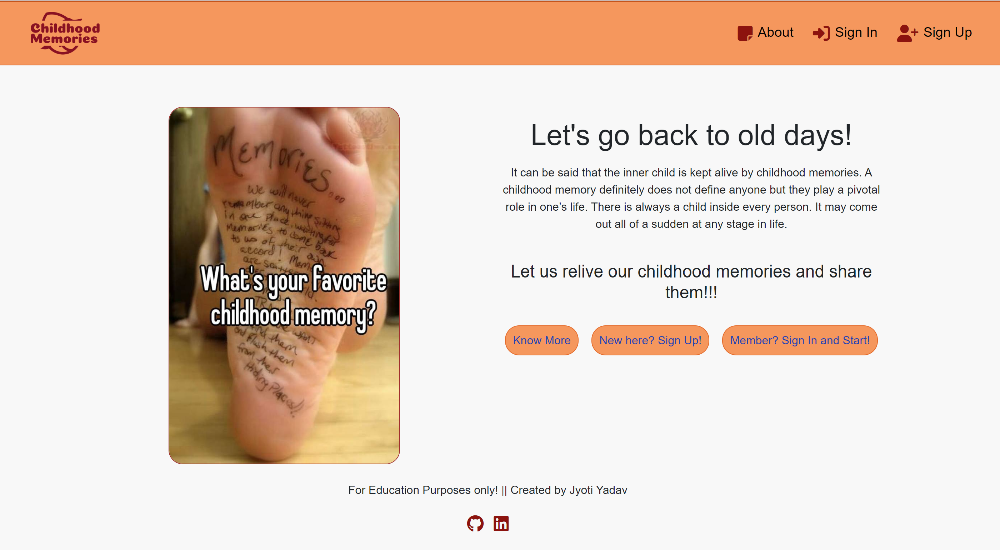

### NavBar
- Featured and consistent on the all pages
- Two variants of the navbar:
  - New or not logged-in users will see the About, Sign up and Sign in icons, as shown in 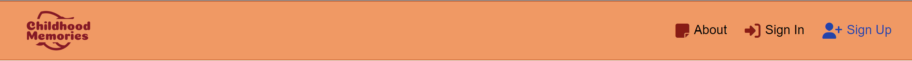
    - NavLink that links to the about page, allowing users to know more about website
	- NavLink that links to the log in page, allowing users to log in
    - NavLink that links to the sign up page, allowing users to create an account
  - For logged in user it shows Home, About, Feed and Liked, Sign Out and Profile Nav items. As shown in 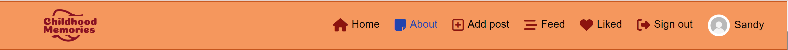
  	- NavLink that links to the home page, displaying all posts of the users the logged in user follows
    - NavLink that links to the about page, displaying more information about website
	- NavLink that links to the liked page, displaying only the posts a user has liked
	- NavLink that signs the user out
    - NavLink that links to the profile page, display information about logged in user
- The NavBar is fully responsive and changes to a toggler (hamburger menu) on smaller size screens.

### About
The 'About' page is created so new users will immediately be able to learn the purpose of the website and get user guidance how to use it and features of this website. The 'About' page serves a useful purpose as it explains what the 'Feed' page is for, and what the 'Liked' page is for. Users will be reminded of the functionality of the website such as the capability of being able to edit/delete posts and comments, not being able to like to their own posts/comments, the character limit of titles and content, etc. All of the information a new user or returning user would possibly need will be found on this page.

As shown here:
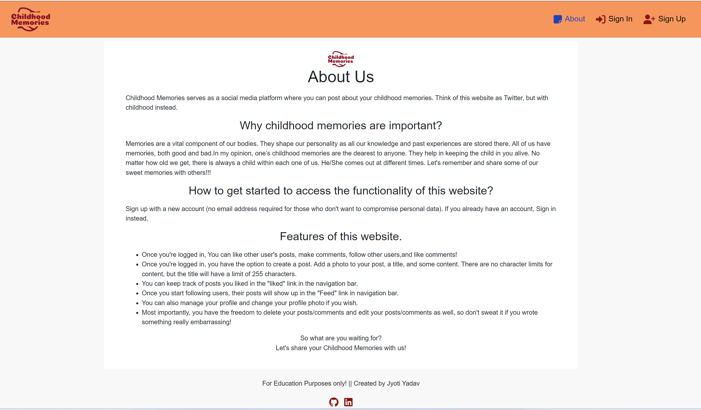

### Sign Up Link and Form
- Allows users to create an account
- Users must provide a valid username and enter their preferred password twice for confirmation
As shown on link provided: 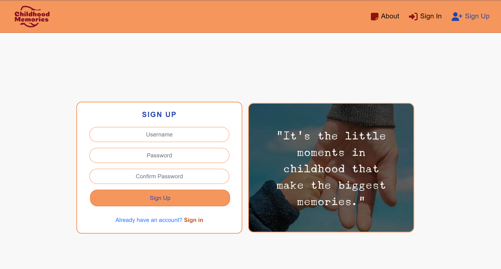

### Sign In Link and Form
- Allows registered users to login to their account
- Both the username and password have to be correct to be signed in
- Displays errors if the username or password is wrong or the input is invalid
As shown on link provided: 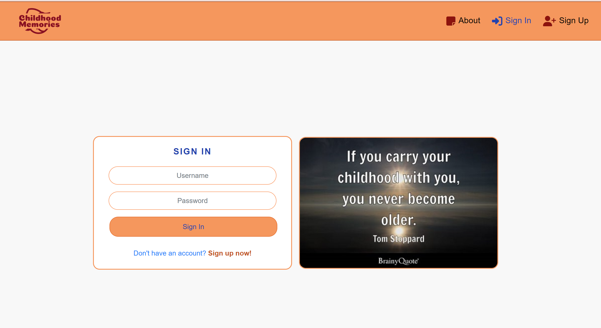

### Post Section (Home)

- The posts are displayed in a single list, styled as cards for clean separation between posts.
- Enabled with infinite scroll feature.
- Each post includes a title, description and image, along with Like and Comments icons showing number they received.
- Clicking on heart icon adds a like to the post.
- Clicking on comments icon takes user to the post detail page which displays all the comments the post recieved.   


### Categories

- User can sort the different categories of posts by selecting a badge. 
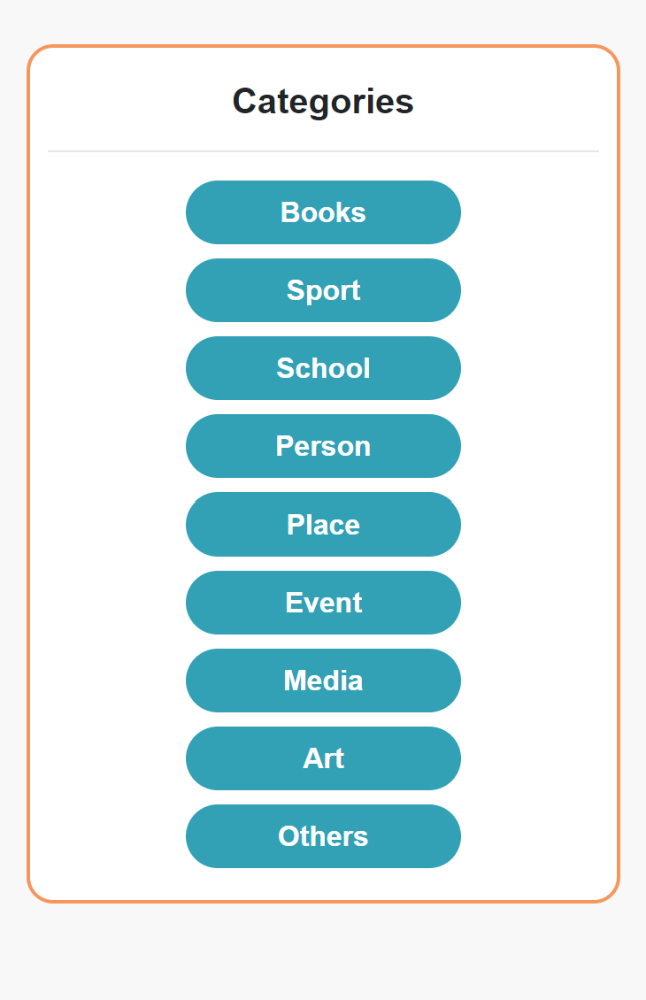

### Search Feature

- By typing a query in the search bar users can find a specific post they are looking for
- Allows to search through all post title, category or author name

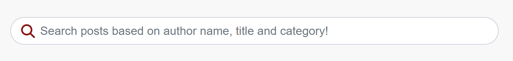

### Popular Profiles

- Reusable component shows 10 most followed profiles in large devices in right column.
- It shows first four most followed profiles in the app in medium to small devices.
- The component displays user avatar, name and follow/unfollow button.
- - Users are able to follow a specific profile they like and then be able to easily view their posts in the Feed.
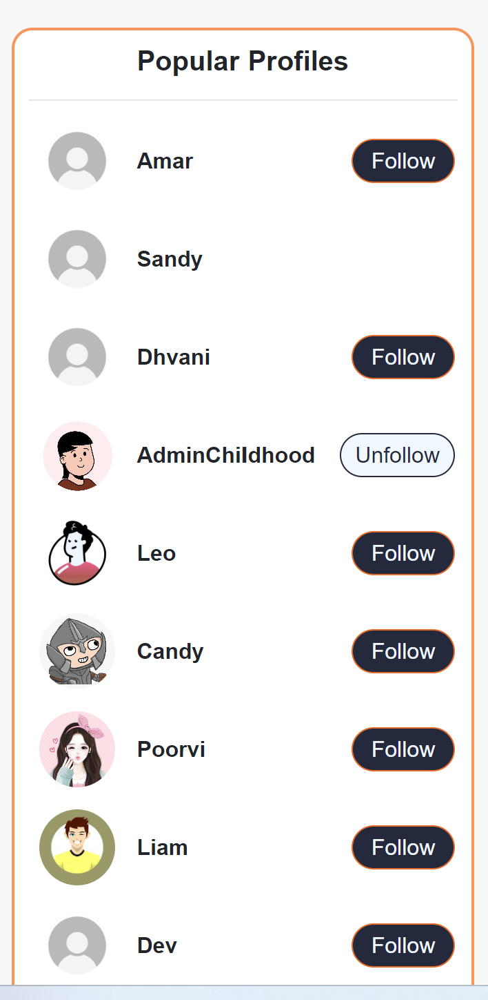

### Feed page

- Contains all posts of users that the logged in user follows
- The posts are displayed in a single list, styled as cards for clean separation between posts.
- Each post includes a title, description and image, along with Like and Comments icons showing number they received.
- Clicking on heart icon adds a like to the post.
- Clicking on comments icon takes user to the slected post's detail page which displays all the comments the post recieved.
- Enabled with infinite scroll feature.

### Liked page

- Contains all posts of users that the logged in user likes 
- The posts are displayed in a single list, styled as cards for clean separation between posts.
- Each post includes a title, description and image, along with Like and Comments icons showing number they received.
- Clicking on heart icon adds a like to the post.
- Clicking on comments icon takes user to the slected post's detail page which displays all the comments the post recieved.
- Enabled with infinite scroll feature.

### Comments Section 

- The section can be found under a post in post detail pages.
- Can be accessed by clicking the comments icon and post.
- Allows users to add a comment on a post.
- Comments can be edited or deleted.
- Displays the date the comment was posted or edited.
- All comments can be read by all other users.
- Editing of other users' comments is not allowed as dropdown menu will not be visible. 
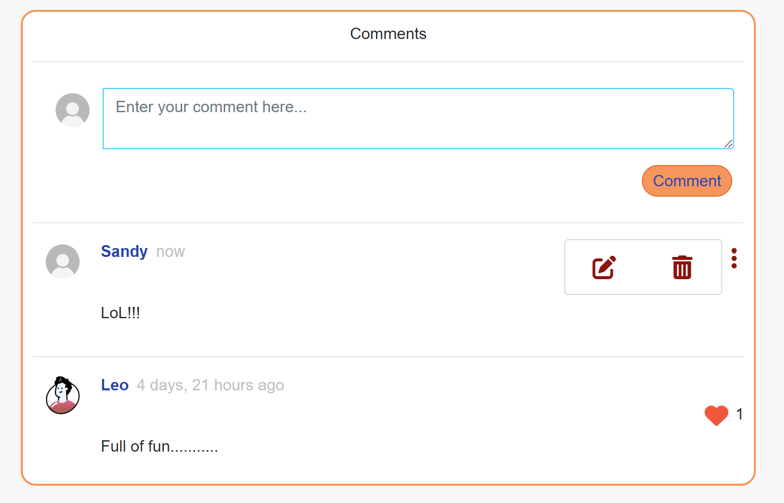

### Post Create Form 

- Logged in user can access the CURD functionality for post.
- Post create form contains title, category, description and image fields that they can fill and update.
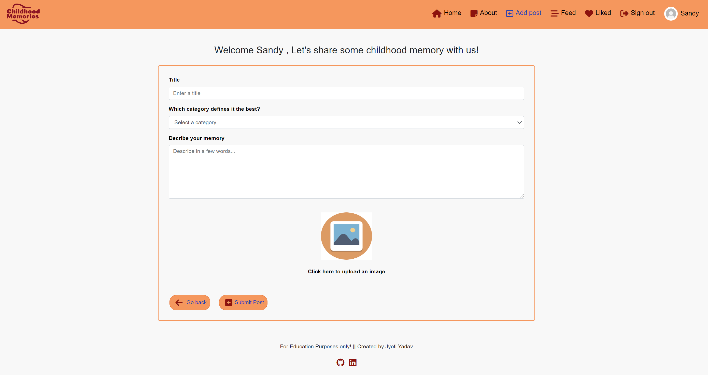

### Post Edit Form 

- Can only be accessed from the post details page by clicking the dropdown menu that can be seen only if the logged in user is the owner of the post as shown 
- Contains title, category, description and image fields that they can fill and update.
- They will be redirected to Post Details page.
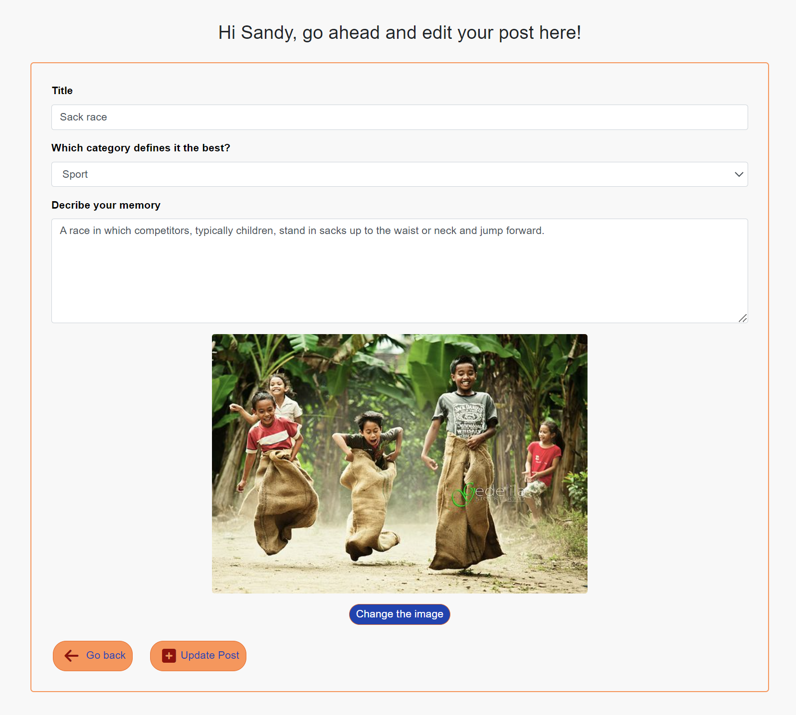

### Like

- A logged in user can like  post that interests them
- A logged in user can unlike post if they are not interested in it
- The liked post will appear in "Liked" page
- The number the likes recieved by the post can be seen on each page.


### Post Detail Page

- Contains details of a single post - image, title, description (if provided by the user) and its category tag
- Contains number of likes and comments the post has
- Contains like icon to allow user to like the post
- Features comments section below the post. 
- Comments add field will be visible to the users.
- Contains a dropdown menu on the post to allow the owner to edit or delete the post
The Post Detail page looks like as shown below:


### Profile Page
- Logged in user can click either avatar from NavBar or from popular profiles panel to navigate to pofile page, where he can update his/her profile info. Also they can see number of post, number of followers, number of following and list of post posted by user so far.
The Post Detail page looks like as shown below:
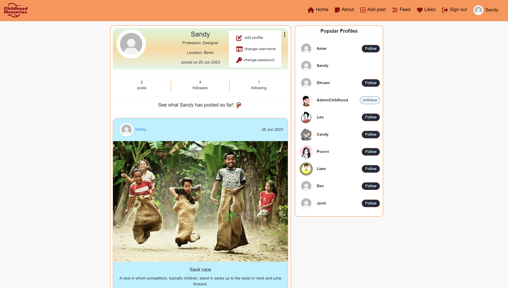

### Delete modal and Alert message 
  - A delete modal is displayed asking the user for confirmation to delete a post or comment.
  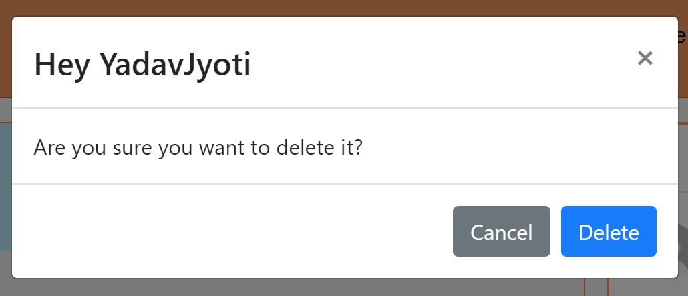)

  - When the user successfully adds a post, an alert message is displayed.
  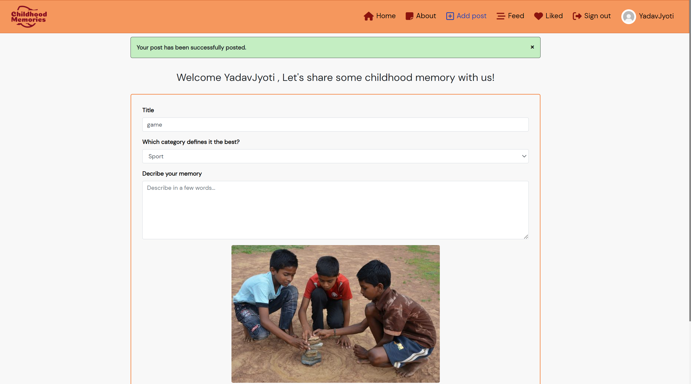

  ---

## Components
A number of the components created are reusable and were used across the website in multiple pages and sections.

- `<Asset />` - Asset.js - renders a loading spinner. It is utilized in several places across the site, including showing a loading spinner where API calls are made.
- `<Avatar />` - Avatar.js - displays a user's profile image. It is used in the Create Panel along with the Username. Passed props allow for setting image source and size and adjust image dimensions depending on where the component is rendered.
- `<DropdownMenu />` - DropdownMenu.js - reusable component, used to render the dropdown menu which allows user to edit or delete their own posts or comments, and also edit their profile or change profile password. provides a dropdown menu with some additional actions a user can take, such as editing and deleting. 
- `<NavBar />` - NavBar.js-  reusable component with the content depending on the login status of the user. For logged in user it shows Home, About, Feed and Liked and Sign Out Nav items. For those who are not logged in, it displays icon links to about, sign up or sign in. The component is used on each page of the app.
- `<PageNotFound />` - PageNotFound.js - specific component to display 404 error message for the url which does not exist.
- `<PopularProfiles />` - PopularProfiles.js - reusable component showing most followed profiles in the app named as "Active Inspirers". The component displays user avatar, name and follow/unfollow button.
- `<DeleteModal />` - DeleteModal.js - reusable component, used to render the modal when user want to delete their own post and comment.


## Technologies

### Languages Used
- [CSS](https://en.wikipedia.org/wiki/CSS)
- [HTML5](https://en.wikipedia.org/wiki/HTML5)
- [JavaScript](https://en.wikipedia.org/wiki/JavaScript)
- [React JSX](https://reactjs.org/docs/introducing-jsx.html)

### Tools

- [Balsamiq](https://balsamiq.com/)- to create the wireframes for the project
- [Chrome dev tools](https://developers.google.com/web/tools/chrome-devtools/) - for debugging of the code and checking site responsiveness
- [LICEcap](https://www.cockos.com/licecap/) - to generate gif files for testing all the features of the app
- [Cloudinary](https://cloudinary.com/) - to store static files
- [Coolors](https://coolors.co/?home) - for color palette
- [Favicon.io](https://favicon.io) - to generate the site favicon
- [Font Awesome](https://fontawesome.com/) - Icons from Font Awesome, used in NavBar and create buttons, like and comment icons
- [Google Fonts](https://fonts.google.com/) - import font
- [Git](https://git-scm.com/) - for version control within VSCode to push the code to GitHub
- [GitHub](https://github.com/) - for remote repository to store project code
- [Gitpod](https://gitpod.io) - to host a virtual workspace
- Validation:
  - [W3C Validator](https://validator.w3.org/) was used to validate the html
  - [Jigsaw W3 Validator](https://jigsaw.w3.org/css-validator/) was used to validate the css
  - [ESLint](https://eslint.org/) used to validate JSX code

### Frameworks, Libraries and Programs

- [React Bootstrap4](https://react-bootstrap-v4.netlify.app/) - For styling the site and site responsiveness across various devices
- [ReactJS](https://reactjs.org/) - To build the functionality of the site
- [Axios](https://axios-http.com/docs/intro) - Used for promise-based HTTP. axios was used to send API requests from the React project to the be_inspired_drf_api and avoid any CORS errors when sending cookies.
- [JWT](https://jwt.io/) - A library to decode out JSON Web token. JWT prevents unauthenticated user from making extra network requests to refresh their access token. It is also used to remove the timestamp from the browser when the user refreshes token expires or the user logs out.
- [Popper](https://popper.js.org/) - A 3rd party library used by React-Bootstrap to make sure the dropdown menus position is fixed on all browsers.
- [React Infinite Scroll](https://www.npmjs.com/package/react-infinite-scroll-component) - To enable component to load content (posts, recommendations and comments) automatically as the user scrolls towards the bottom of the page without having to jump to next/previous page.
- [React Router](https://v5.reactrouter.com/web/guides/quick-start) - Used for dynamic routing. This library enables the navigation among views of various components and control what the user can see depending on the URL they have accessed in the browser.

[Back to top ⇧](#contents)

## Production

Installations:

- React library - using the command `npx create-react-app . --template git+https://github.com/Code-Institute-Org/cra-template-moments.git --use-npm`
For the React project set up
- react-bootstrap - using the command `npm install react-bootstrap@1.6.3 bootstrap@4.6.0`
This is used to render the layout and styling of the website. The library makes it easy to create and use standard interface elements that are responsive.
- react-router-dom - using the command `npm install react-router-dom@5.3.0`
 This library makes the site navigation easier without the need to refresh the page. In social media sites ith mutiple components, it provides a quick and responsive user experience.
- axios - installed using command `npm install axios`.It manages the calls to the backend database. Simplifies the API requestsand the included interceptors refresh JSON Web Tokens which the site uses.
- infinite-scroll-component - installed using command ` npm install react-infinite-scroll-component`.
It is used to enable infinite scrolling on the Posts and Recommendations components and on comments. Infinite scrolling is a standard feature in all social media sites.
- jwt decode - Using command `npm install jwt-decode`. Used to remove requests to refresh an access token for signed out users. It enables the refresh token to be decoded so that a timestamp can be put in local storage, if a timestamp does not exist in the user's local storage then access refresh requests will not be made.

## Issues and Fixes

Many bugs have occurred during the development of the front end project. Most notable bugs are listed below:

(1) Issue: When click on like icon in comment box, it showed NaN written instead of number of likes and when refreshed like icon changed into unlike.<br>
  - Fix: Add get_comment_likes_id function in comment model and replace queryset=comment.object.all with annotate method in view.py file. Also add related_name='comment_likes' in comment field in comment_likes model.

(2) Issue: Collapse NavBar didn't display background color when expend it in small devices.<br>
  - Fix: Style the NavBarCollapse class with background-color:#fa9455 !important.

(3) Issue: Home nav link is always active even if we are active on another nav link.<br>
  - Fix: Replace the exact path="/" to "/home" in Route in app.js 

(4) Issue: DeleteModal was not disappear while clicking on delete icon from dropdown menu.<br>
  - Fix: delete const handle =() => setShowModel(false) from deleteModal.js because it already define in parent component.

(5) Issue: After installing 'eslint' I came accross the error for InfiniteScroll in PostDetailPage, ProfilePage and PostListPage.
<details>
<summary>Children props error in Infinite scroll</summary>
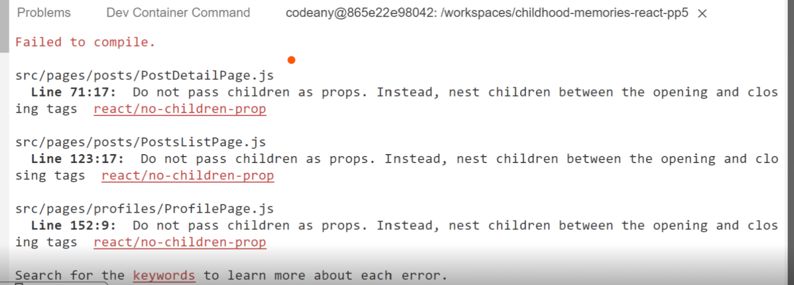
</details>
  - Fix: Remove the children element from infinite scroll and place the code between the tags. 
<details>
<summary>Solution of children props error in Infinite scroll</summary>
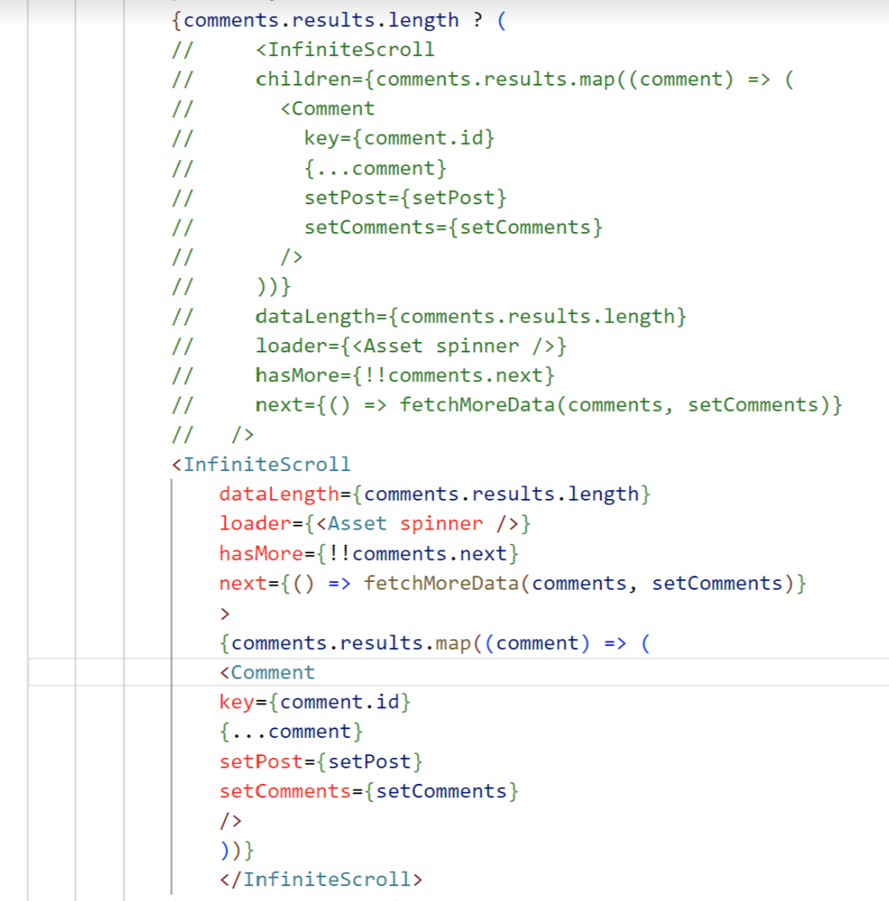
</details>


## Testing
Testing has taken place continuously throughout the development of the project. Each view was tested regularly. When the outcome was not as expected, debugging took place at that point. An exhaustive list of features were checked on different devices and browsers. They were performed and their scrrenshots can be found in the features section on how the distinct features render.

- Link for TESTING.md file:- [Testing Results Here](TESTING.md)


## Deployment

### Heroku

This application has been deployed from GitHub to Heroku by following the steps (these are steps after you have set up the front end project in the Config Vars of the back end project):

1. Create or log in to your account on [Heroku.com](https://www.heroku.com/).
2. Create a new app, add app name and choose your region.
3. Click on create app.
4. In Terminal of your project, push your changes to GitHub.
5. Log in to Heroku.com and open the dashboard for your react application (for the front end).
6. Click on the 'Deploy' tab and go to 'Deployment Method' and choose GitHub
7. Navigate to 'App connected to GitHub' and search for the relevant repository
8. Select the repository you wish to deploy and click 'Connect'
9. Scroll down to the bottom and then select “Manual deploy”, and choose your repository. 
10. Wait for your build to complete.
11. When you see the message “deployed to Heroku” in the build log, click the “open app” button at the top of the page.

### Connecting to API

 - Navigate to the Heroku app for Be-Inspired_DRF_API project and under the 'Settings' tab add the following config vars: Key: Client_Origin and Key: Client_Origin_Dev 
- Ensure that the trailing '/' of the value of these key is removed from the end of both links and save the config vars.
- Install the Axios package, and create the supporting axiosDefaults.js file

### Final Deployment

1. Comment out all the console.log within the codes.
2. Navigate to package.json and in the scripts section add the following command:
```
"heroku-prebuild": "npm install -g serve,"
```
3. Add a Procfile to the root of the project with the following:
```
web: serve -s build
```
4. Git add, commit and push your code
5. Navigate to Heroku and deploy the project via the deploy button under the 'Deploy' tab

[Back to top ⇧](#contents)


## Credits and Resources

- [Code Institute Moments Project](Solutions)
    - Functionality of the project credit goes to Code Institute. Comments are made along the project of where code is used from Code Institute's Moments project. 

- [Stack Overflow](https://stackoverflow.com/)
    - Stack Overflow was referred to many times while trying to debug code. 

- [JSX Validation](https://gist.github.com/ianmeigh/8e603b91a38d7829d959402bfcf29d3d)
    - Ian Meigh's tutorial on ESlint was used for ESlint testing.

- [React Bootstrap](https://react-bootstrap.github.io/)
    - Components from React Bootstrap were used in the project (Navigation bar, forms, cards, etc).

## Acknowledgements

- My Mentor Mr. Akshat Garg for his guidance and advice during the project.

- Thank you to Tutor Support for always being there for me, and always being patient with my questions.

- Thank you to CI Slack Channel for taking time out of their day to answer my questions.

[Back to top ⇧](#contents)